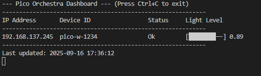
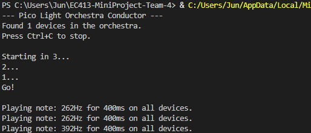

# 2025 Fall ECE Senior Design Miniproject

[Project definition](./Project.md)

This project uses the **Raspberry Pi Pico 2WH SC1634** (wireless, with header pins).

Each team must provide a micro-USB cable that connects to their laptop to plug into the Pi Pico.  
The cable **must have data pins connected**. Splitter cords with multiple connectors often do not have data pins wired.  
Such micro-USB cables can be found locally at Microcenter, convenience stores, etc.  

The student laptop is used to program the Pi Pico.  
The laptop software to program and debug the Pi Pico works on macOS, Windows, and Linux.

This miniproject focuses on using [MicroPython](./doc/micropython.md) with the [Thonny IDE](./doc/thonny.md).  
Other IDEs can also be used, including Visual Studio Code or [rshell](./doc/rshell.md).

---

## Demo Video

[](https://youtu.be/8RlqUY500Eo)
- Click the image above.
  This first video portrays how our device takes light and plays music. You can also see how shadow affects the music, when the hand is passed above the light sensor the music/note changes.

## Screenshots


- While running the system we can check the status of the pi in the list. The status is important b/c it allows us to ensure the Pico is working properly and efficiently. Avoiding hardware erros or alerting us of errors in general.


- The image shows the system after 3 seconds of waiting, that the player sends packets to play the song. We used these packets get requests to portray the user inputs.


## Hardware

* Raspberry Pi Pico 2WH [SC1634](https://pip.raspberrypi.com/categories/1088-raspberry-pi-pico-2-w) (WiFi + Bluetooth, with header pins)
* Freenove Pico breakout board [FNK0081](https://store.freenove.com/products/fnk0081)
* Piezo Buzzer SameSky CPT-3095C-300
* 10kΩ resistor
* Photoresistor (light sensor)

---

## Photoresistor Details

The photoresistor is used with a **10kΩ resistor in a voltage divider** [circuit](./doc/photoresistor.md):

- 10kΩ resistor connects between **3V3** and **ADC input**.  
- Photoresistor connects between **ADC input** and **AGND**.  
- Polarity is not important.

In MicroPython, the [`machine.ADC`](https://docs.micropython.org/en/latest/library/machine.ADC.html) class is used to read the analog voltage.  
On the Pico W, GP26 is **ADC0**, GP27 is **ADC1**, and GP28 is **ADC2**.  

⚠️ In this project, **GP26 (ADC0)** is used for the photoresistor:  

```python
photo_sensor_pin = machine.ADC(26)


